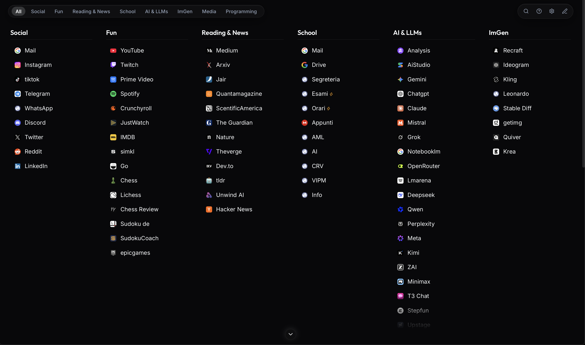
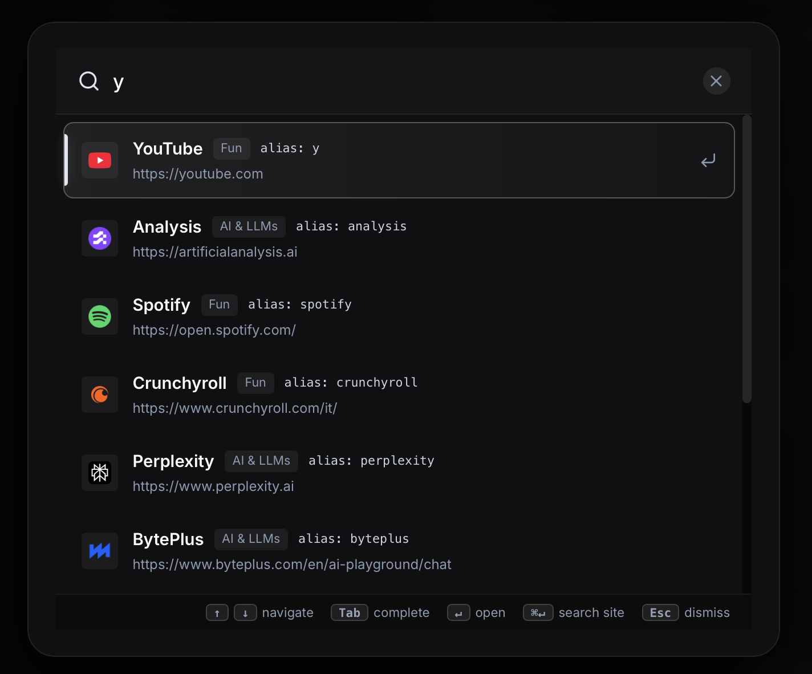

<p align="center">
  
</p>

<h1 align="center">⚡ Startpage</h1>

<p align="center">
  <strong>A blazing-fast, keyboard-driven browser startpage with a deep OLED dark aesthetic.</strong><br/>
  Fully static — works offline, from <code>file:///</code>, or on GitHub Pages. Zero backend required.
</p>

<p align="center">
  
  
  
  
</p>

---

## ✨ Features

| Feature | Description |
|---------|-------------|
| 🔍 **Fuzzy Search** | Start typing anywhere — instant fuzzy matching across all links and aliases |
| ⌨️ **Command Palette** | Prefix searches: `g query` (Google), `yt query` (YouTube), `gh query` (GitHub), `w query` (Wikipedia) |
| 🎯 **Smart Ranking** | Links are ranked by usage frequency — your most-used links appear first |
| 🖱️ **Drag & Drop** | Reorder links and categories with ultra-smooth drag & drop, emerald insertion indicators |
| 📂 **Category Columns** | Links organized in scrollable category columns with jump-bar filtering |
| 🎨 **Visual Editor** | Right-click any link to edit title, URL, icon, color, and category |
| 📋 **Import/Export** | Full JSON backup & restore of your link configuration |
| ⌨️ **Keyboard Shortcuts** | `Ctrl+1..9` quick-open results, `?` cheatsheet, `Esc` close modals |
| 🕐 **Live Clock** | Minimal header clock with date display |
| 💾 **LocalStorage** | All customizations persist in browser — no account needed |
| 🌙 **OLED Dark Theme** | Deep obsidian (#08090c) with platinum text and emerald accents |
| 📱 **Responsive** | Adapts from ultrawide monitors to mobile screens |

---

## 🖼️ Screenshots

<p align="center">
  
  <br/><em>Main dashboard with category columns, jump bar, and live clock</em>
</p>

<p align="center">
  
  <br/><em>Fuzzy search with command palette prefixes and smart ranking</em>
</p>

---

## 🚀 Quick Start

### Use it directly

1. **GitHub Pages** — Visit the [live site](https://enneemme.github.io/startpage/) (replace with your URL)
2. **Local file** — Download `index.html` and open it in your browser (`file:///path/to/index.html`)
3. **Set as homepage** — Point your browser's new tab / homepage to the URL

### Set as New Tab Page (Chrome)

1. Install an extension like [Custom New Tab URL](https://chrome.google.com/webstore/detail/custom-new-tab-url/mmjbdbjljfnkjhgbldlhjckimhkmfbgp)
2. Set the URL to `https://enneemme.github.io/startpage/` or `file:///path/to/index.html`

---

## ⌨️ Keyboard Shortcuts

| Shortcut | Action |
|----------|--------|
| `Any key` | Activate fuzzy search |
| `↑` / `↓` | Navigate search results |
| `Enter` | Open selected result |
| `Ctrl + 1..9` | Quick-open result #1–9 |
| `Esc` | Close active modal |
| `?` or `F1` | Toggle shortcuts cheatsheet |
| `Cmd + /` | Toggle cheatsheet |

### Command Palette Prefixes

| Prefix | Engine |
|--------|--------|
| `g` | Google Search |
| `yt` | YouTube Search |
| `gh` | GitHub Search |
| `w` | Wikipedia |
| `ddg` | DuckDuckGo |

---

## 🏗️ Architecture

```
main branch (this)     →  Production build (static index.html)
dev branch             →  Source code (Preact + TypeScript + Vite)
```

The production build is a **single self-contained `index.html`** file (~241 KB) that includes all JavaScript, CSS, and 240 embedded SVG icons inlined. It requires no server, no network requests for core functionality, and works perfectly offline.

### Tech Stack

- **UI**: [Preact](https://preactjs.com/) (lightweight React alternative)
- **Build**: [Vite](https://vitejs.dev/) with single-file HTML output
- **Language**: TypeScript (strict mode)
- **Icons**: 240 static Lucide-compatible SVG paths (region inlined, no runtime icon library)
- **Styling**: CSS Modules + CSS Custom Properties (design system tokens)
- **Storage**: Browser LocalStorage for persistence
- **Testing**: Vitest (30 suites / 241 tests)

---

## 🔧 Development

Switch to the `dev` branch to work with the source code:

```bash
git checkout dev
bun install       # or: npm install
bun run dev       # Start Vite dev server
bun run test      # Run Vitest test suite (30 suites / 241 tests)
bun run build     # Build production index.html → dist/
```

---

## 📦 Default Categories

| Category | Links |
|----------|-------|
| **Social** | Gmail, Instagram, TikTok, Telegram, WhatsApp, Discord, Twitter, Reddit, LinkedIn |
| **Fun** | YouTube, Twitch, Prime Video, Spotify, Crunchyroll, Chess.com, Lichess, and more |
| **AI & LLMs** | Google AI Studio, Gemini, ChatGPT, Claude, Mistral, Grok, Perplexity, DeepSeek, and more |
| **Reading & News** | Medium, Arxiv, Quanta Magazine, The Guardian, Nature, Hacker News, and more |
| **School** | University mail, drive, course pages, exam schedules (Unimib) |
| **Dev & Tools** | GitHub, Vercel, npm, MDN, Stack Overflow, and more |
| **Image Generation** | Midjourney, DALL-E, Leonardo AI, Ideogram, and more |

> All categories and links are fully customizable through the visual editor or JSON import/export.

---

## 📄 License

This project is open source. Feel free to fork and customize it for your own startpage!
